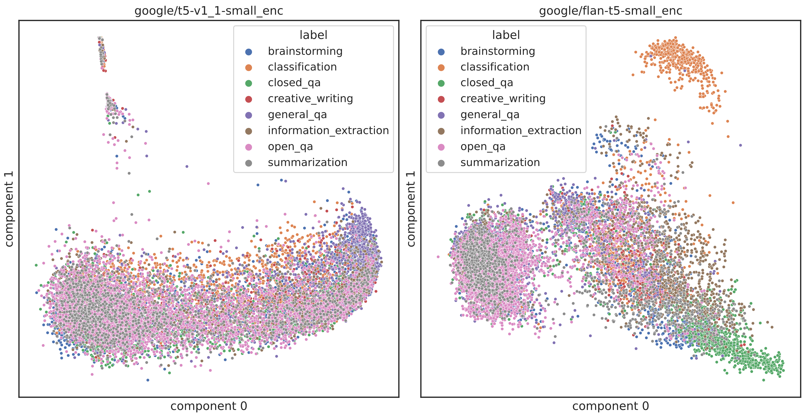

# Dolly-15k-Analysis
This is a repository for intrinsic analysis of the T5 model in dolly-15k dataset. An experiment was conducted to compare changes according to the size of the T5 model for the Instruction dataset. In addition, a comparative analysis was conducted on the differences between the T5 and Flan-T5 models.


The image above is a pca visualization of the Instruction column of the dolly-15k dataset using the T5-small model and the Flan-T5-Small model. One point corresponds to the cls token of the last layer of the Encoder part of the model.


 </br>

## Getting stated
***Configuration***
 ```
 pip install -r requirements.txt
 ```
 </br>
 
***1.Extract hidden states from the model using the instruction data.***
 ```
python extract_model_embedding.py -m google/t5-v1_1-small -b 32 -i 128 -n 1000 -g "0"
python extract_model_embedding.py -m google/t5-v1_1-base -b 8 -i 128 -n 1000 -g "0"
python extract_model_embedding.py -m google/t5-v1_1-large -b 4 -i 128 -n 1000 -g "0"
python extract_model_embedding.py -m google/t5-v1_1-xl -b 1 -i 128 -n 1000 -g "0"
 ```
Each option has the following meaning. [-b: batch_size, -i: input_data_length, -n: number_of_analysis_data, -g: number of gpu index] 
The above command was written by adjusting the batch size according to the model size based on 24GB VRAM GPU. Please adjust the batch size according to the size of your GPU VRAM.


</br>


***2.Create visualization images***
 ```
python visualize_embedding.py -m google/t5-v1_1-small
python visualize_embedding.py -m google/t5-v1_1-base
python visualize_embedding.py -m google/t5-v1_1-large
python visualize_embedding.py -m google/t5-v1_1-xl
 ```
The current code creates all visualization images that can be created in the t5_pca_image folder. You can modify the code to only store images for the hidden states you want.

